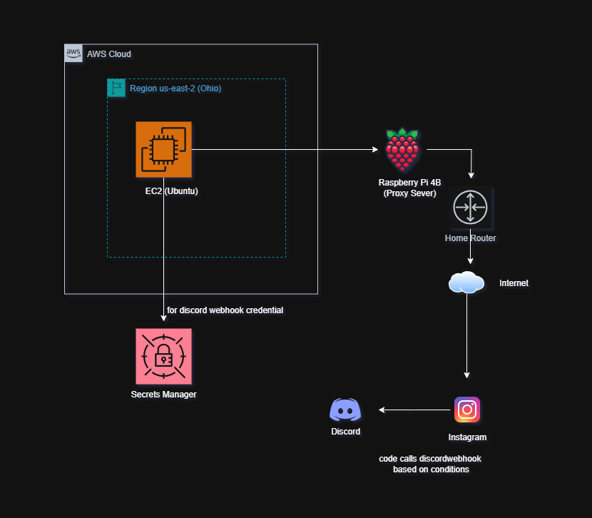

# aws-selenium-security-automation

## To Do:
- [x] Actually implement the Security Manager into the code
- Work on the docs files
    - [ ] finish (mullvad) gpg by today
- Look more into the security aspect (eg. restrict ssh ips)
- set up pi proxy asap - try to get whole project complete this week
- for best practice, note that the python script should use venvs to separate packages
- maybe include a page for random security notes, like in trying to use a vpn i somewhat learned about pgp keys (like at least how to use mullvad's pgp keys)
    - so the task would be to: flesh out knowledge and create a docs for it
    - another topic could be: vncserver
- get help from online communities for diagram improvement
- learn terraform and aws alternative (cloud formation) to try to spin up vms from code - is it possible to even load python scripts into these instances via these IaC

## Project Purpose
To provide a discrete and customizable method to recieve Instagram notifications via Discord.

## Project Overview:
Run a Selenium script on an Ubuntu EC2 instance which I interact with via GUI thru RealVNC Viewer and which connects to my Raspberry Pi 4B proxy server in order to continuously monitor the Instagram DMs page and call my Discord webhook when I receive a new DM.

## Architecture & Security Design

### Security Considerations:
1. AWS Security Manager
2. 

## Technologies
- AWS EC2 (Ubuntu)
- Selenium WebDriver
- RealVNC Viewer
- Raspberry Pi 4B
- Discord Webhooks
- Python

## Setup Instructions

### Manual Provisioning:
1. **EC2 Instance Setup**
Include steps here:

If you would rather provision your instance via IaC tools, here are their respective steps:
- [Provisioning via AWS CloudFormation](docs/aws_cloudformation.md)
- [Provisioning via Terraform](docs/terraform.md)

### Raspberry Pi Proxy Setup
Follow the [Raspberry Pi proxy guide](docs/raspberry-pi-proxy.md)

## Future Security Enhancements