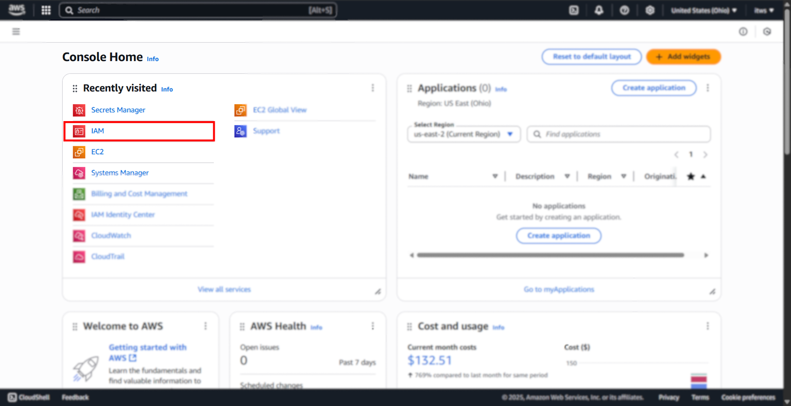
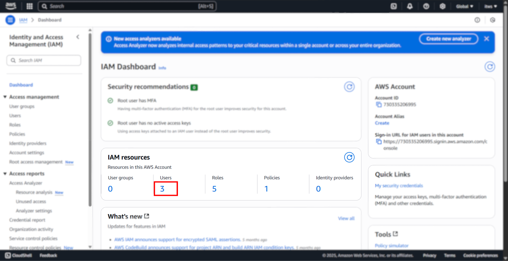
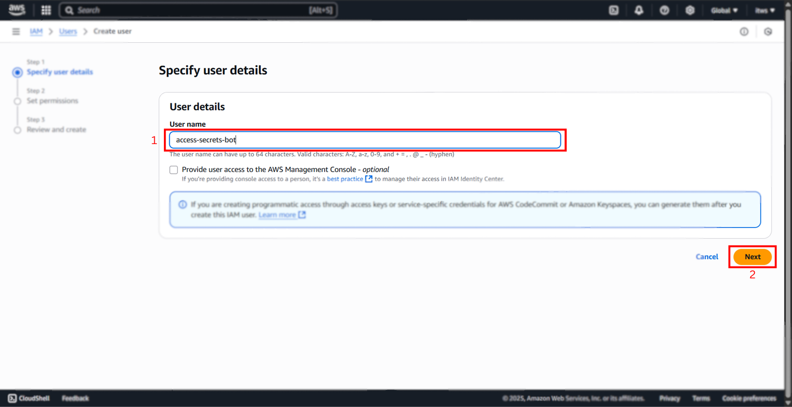
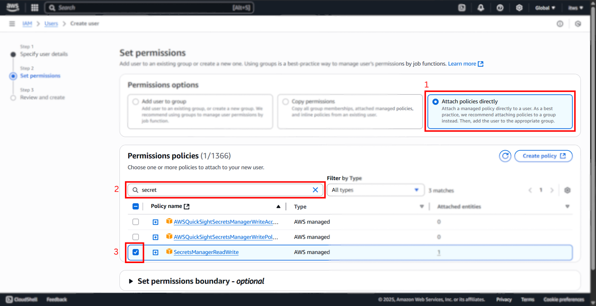
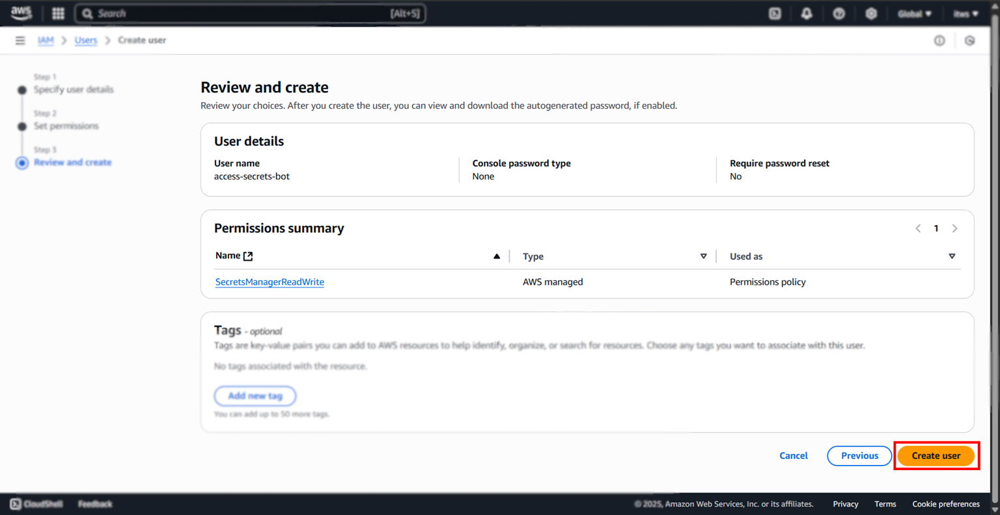
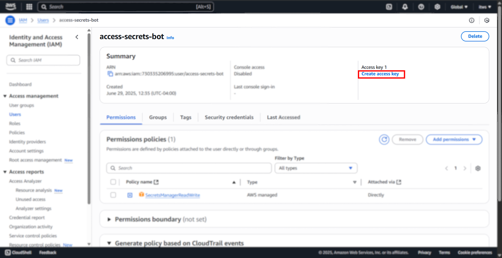
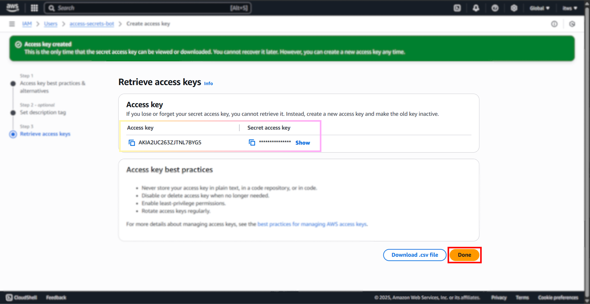
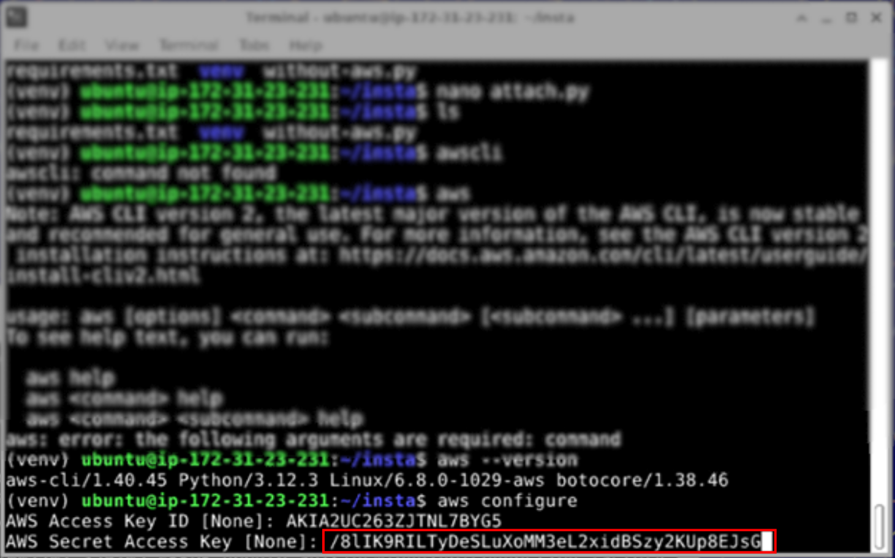
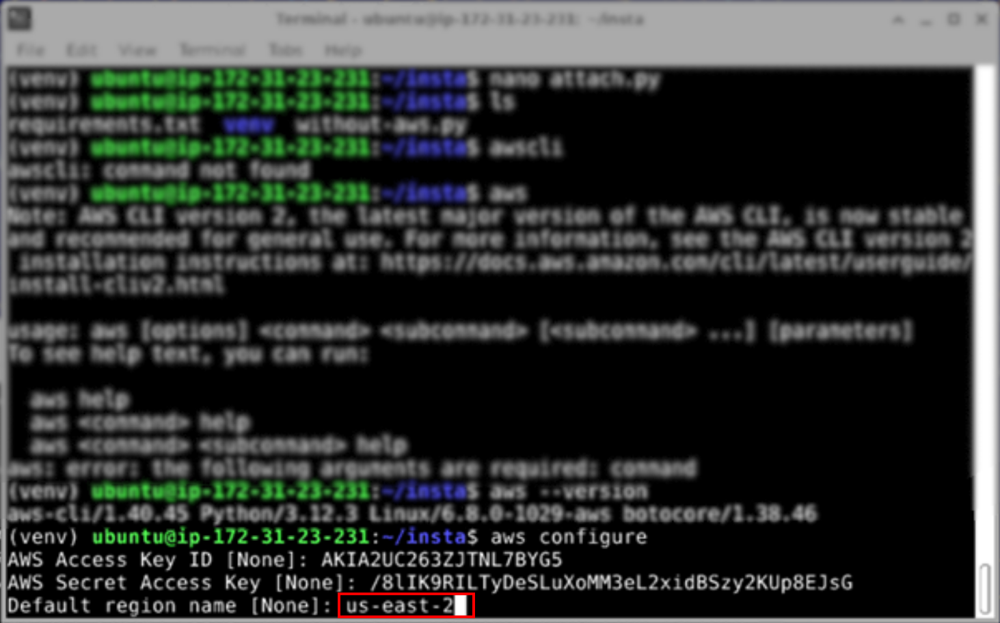
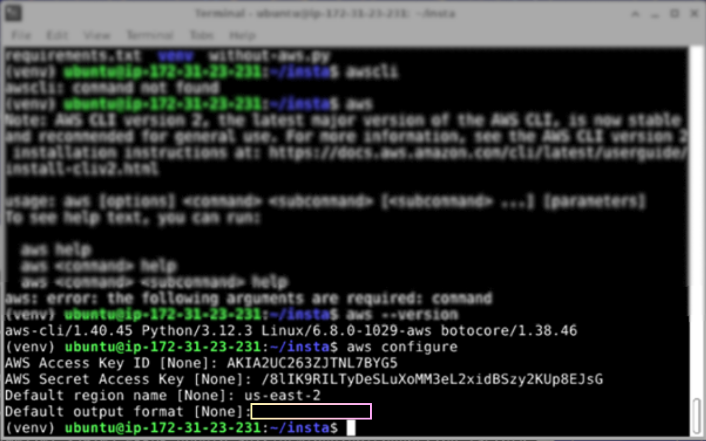

# Creating IAM User

### Overview

What is an IAM User:

Purpose of creating one:

End goal:

## Step-by-Step Instructions:

1. Assuming you're at the AWS Management Console, click on / search for "IAM". Here's what it'd look like if you were to click on it:

2. Now, you should be at the Identity and Access Management (IAM) dashboard. Find the IAM Resources block, which should be in the center of the IAM Dashboard, and locate "Users". Click on the number below it.

3. Now you should see a list of IAM users that exist on your account. Click the "Create user" button at the top right to create a new user.

4. Give your IAM user a name.

Then click "Next" at the bottom right.

5. Now, we're on the settings page. First, click on the "attach policies directly" option. 

Then, search for "secret" in the "Permissions policies" search bar.

Once "SecretsManagerReadWrite" option is visible, check that option ON.

Scroll down and click "Next".

6. Finally, you're at the review page, do a cursory glace at this page to make sure everything looks right.

Click "Create user".

7. After the loading screen finished, you should be back at IAM's home. And you should see your user as part of the Users list.

If you look at my list in the image below, you can see the User at the top of the list of Users.

Click on it.

8. Now, we need to create an access key so that our code, via AWS CLI, can access the Secret.

Click on the top right, which says "Create access key".

9. Here, we specify that we intent to use this key via the CLI, so select that option.

10. Scroll down, click the check box under "Confirmation", and click "Next".

11. You may add a description tag value to this User if you so wish.

Click "Create access key".

12. Finally, on this page, you should be able to see your "Access key" and "Secret Access key".

NOTE: After you leave this page, you CANNOT retrieve your credentials again, so keep this information safe. We'll need to input this information in our terminal.

---
### GUI Instructions

Now, switch back to your GUI interface for your VM. We need to configure the AWS CLI.

13. To start, type `aws configure`. If installed correctly, it will prompt you to enter your access key ID, enter the AWS Access Key from the previous screenshot.

14. Now, you should be prompted to enter your "AWS Secret Access Key". Here you should enter the "Secret access key" that was provided in the screenshot in bullet point 12.

Also, just FYI, I did revoke this access key :)

⚠️ Security Tip: Never commit access keys to version control or share them in screenshots. If you do, revoke them immediately (like I did!).

15. Now enter a default region name - choose the AWS region where your resources (like secrets or EC2 instances) are hosted, e.g., `us-east-2`.

16. Now, you'll be prompted to enter a default output format. It determines how CLI responses are displayed (e.g., json, table, or text). You can press Enter to skip.

After that, you should have successfully configured your AWS CLI with your IAM User!

